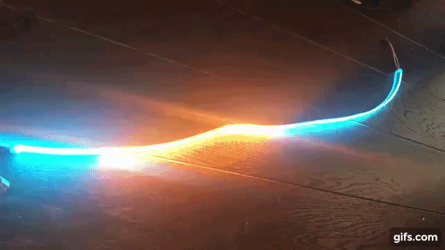

# Ambient
ESP32 as Bluetooth Low Energy driver for addressable LED strip

### Build and flash
- [Arduino IDE](https://www.arduino.cc/en/software)
  + [Esp32 board](https://github.com/espressif/arduino-esp32#installation-instructions)
- Libraries
  + NeoPixelBus
  + ArduinoJson
